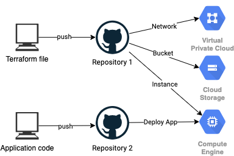

# Repo Intro
This repo is used to learn terraform. 

Will be following the following tutorial to deploy my streamlit app to GCP: [link](https://towardsdatascience.com/rapid-prototyping-using-terraform-github-action-docker-and-streamlit-in-gcp-e623ae3fdd54)

Workflow Overview:
1. Writing Terraform file locally and pushing it to GitHub.
2. Automating GCP provisioning using Terraform by GitHub Action.
3. Writing Streamlit app code and Dockerfile locally and pushing the code to GitHub.
4. Deploying the code to Virtual Machine instance in GCP by GitHub Action.
